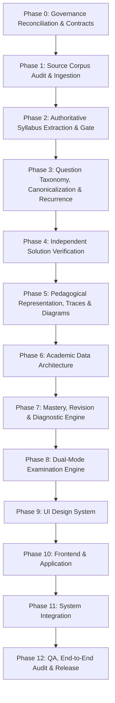

# DSA EXAM SYSTEM — STAGED ENGINEERING PIPELINE
**Course Code:** CSE / CSEN 2101 (Data Structures and Algorithms)  
**Document Version:** 1.1.0 — RECONCILED & AUTHORITATIVE  
**Status:** BINDING & GATED  
**Phase:** Prompt 0.1 Governance Reconciliation  
**Date:** October 2026  

---

## 1. PIPELINE OVERVIEW & STAGED GOVERNANCE

The CSE/CSEN 2101 Exam System follows a strict, sequential, integrity-gated pipeline comprising **13 distinct phases (Phase 0 through Phase 12)**.

### Core Pipeline Laws
1. **Sequential Advancement:** No phase may begin execution until its preceding phase has passed its formal Release Gate and fulfilled all Acceptance Criteria.
2. **Precedence Protection:** No later phase may silently override or weaken an earlier academic integrity rule.
3. **Traceability:** Every question, solution, provenance tag, and trace produced across all phases must maintain verifiable bidirectional links to physical source documents.

---

## 2. DETAILED PHASE SPECIFICATIONS

### PHASE 0: GOVERNANCE RECONCILIATION & SYSTEM CONTRACTS
- **Purpose:** Establish an immutable, internally consistent engineering constitution, decision register, non-negotiables checklist, and pipeline without unapproved assumptions.
- **Inputs:**
  - Authoritative Prompt 0 and Prompt 0.1 directives.
  - Course identity context: CSE / CSEN 2101.
- **Outputs:**
  - `GOVERNANCE_CORRECTION_LOG.md`
  - `SYLLABUS_INPUT_REQUIRED.md`
  - `PROJECT_SYSTEM_CONTRACT.md` (v1.1.0)
  - `PROJECT_DECISION_REGISTER.md` (v1.1.0)
  - `PROJECT_NON_NEGOTIABLES.md` (v1.1.0)
  - `PROJECT_PIPELINE.md` (v1.1.0)
  - `REVIEW_MANIFEST.md` & `CSE2101_GOVERNANCE_REVIEW_BUNDLE.zip`
- **Dependencies:** None.
- **Acceptance Criteria:**
  1. 100% compliance with the authoritative System Contract and Decision Register.
  2. All 12 reconciliation categories resolved and documented in the correction log.
  3. Internal consistency self-audit passes across all governance artifacts.
  4. Public review bundle verified and downloadable.
- **Explicit Stop Condition:** Stop immediately upon generation and verification of governance artifacts and review bundle. Do NOT ingest the source corpus, extract questions, or build UI.

---

### PHASE 1: SOURCE CORPUS AUDIT & INGESTION
- **Purpose:** Ingest, inspect, catalog, and extract all questions and raw metadata from the physical source corpus (`d:\DOWNLOADS\CSE2101\SOURCE`) without assuming all files are exam papers.
- **Inputs:**
  - Physical source corpus of 33 PDF files (16 in root `SOURCE`, 17 in nested `DSA-20260930T180448Z-1-001/DSA/`).
- **Outputs:**
  - `SOURCE_CORPUS_INVENTORY.json`: Manifest of all 33 files with hash, page count, and source classification (`University_Exam_Paper`, `Backlog_Paper`, `Question_Bank`, `Practice_Assignment`, `Solution_Document`, `Notes`, `Objective_Bank`).
  - `RAW_EXTRACTED_QUESTIONS.json`: Verbatim extracted question instances with preserved provenance (`source_file`, `page_number`, `source_tier`, `source_type`, and where established: `year`, `branch`, `exam_type`, `paper_id`, `question_number`, `marks`). Fields not established by source are stored as `null`.
  - `DAMAGED_AND_INCOMPLETE_QUESTIONS_AUDIT.json`: Ledger of all incomplete, cut-off, or diagram-deficient questions excluded under Rule 2.5.
- **Dependencies:** Phase 0 complete and verified.
- **Acceptance Criteria:**
  1. 100% of 33 PDF files cataloged with verified SHA-256 checksums.
  2. Zero synthetic questions injected; zero provenance fields fabricated.
  3. All questions classified into Three-State Wording Model (State A, State B, or State C).
  4. All State C (incomplete) questions quarantined in the audit ledger.
- **Explicit Stop Condition:** Stop upon completing extraction, cataloging, and exclusion logging. Do NOT classify into topics or begin syllabus gating.

---

### PHASE 2: AUTHORITATIVE SYLLABUS EXTRACTION & STRICT SYLLABUS GATE
- **Purpose:** Ingest the authoritative university syllabus artifact, extract canonical topics for Modules 1 & 2 without inference, enforce Module 3 quarantine, and gate in-scope Module 4 algorithms.
- **Inputs:**
  - `RAW_EXTRACTED_QUESTIONS.json`
  - Authoritative University Syllabus Document for CSE2101 / CSEN2101 (gated by `SYLLABUS_INPUT_REQUIRED.md`).
- **Outputs:**
  - `CANONICAL_SYLLABUS.json`: Authoritative taxonomy of Module 1 (FULL), Module 2 (FULL), and in-scope Module 4 algorithms.
  - `ACTIVE_SYLLABUS_CORPUS.json`: Sourced questions strictly conforming to allowed Modules 1, 2, and 4.
  - `OUT_OF_SYLLABUS_ARCHIVE.json`: Segregated archive of Module 3 questions and non-listed algorithms with explicit conflict citations.
  - `SUPPORTING_PREREQUISITES_REGISTER.json`: Catalog of foundational concepts flagged as `SUPPORTING PREREQUISITE`.
- **Dependencies:** Phase 1 complete; Authoritative Syllabus Document supplied.
- **Acceptance Criteria:**
  1. Zero Module 1 or Module 2 subtopics inferred or hallucinated; all nodes match the authoritative syllabus document.
  2. Exactly ZERO Module 3 questions present in `ACTIVE_SYLLABUS_CORPUS.json`.
  3. Module 4 strictly restricted to listed sorting and searching algorithms; Quick Sort flagged with NO complexity-analysis requirement.
  4. All quarantined items logged with explicit syllabus conflict tags.
- **Explicit Stop Condition:** Stop upon completing syllabus extraction and corpus partitioning. Do NOT deduplicate or taxonomy-classify questions.

---

### PHASE 3: QUESTION TAXONOMY, CANONICALIZATION, VARIANTS & RECURRENCE
- **Purpose:** Classify active questions into the 7-class taxonomy, map exact/near duplicates to Canonical Questions, identify material variants requiring separate solutions, and record factual recurrence.
- **Inputs:**
  - `ACTIVE_SYLLABUS_CORPUS.json`
  - `CANONICAL_SYLLABUS.json`
- **Outputs:**
  - `QUESTION_FAMILIES.json`: 5-tier hierarchical taxonomy (`Module` $\longrightarrow$ `Topic` $\longrightarrow$ `Core Question Family` $\longrightarrow$ `Question Form` $\longrightarrow$ `Source Question`).
  - `CANONICAL_QUESTIONS.json`: Deduplicated canonical questions with linked arrays of all confirmed source occurrences (`year`, `branch`, `exam_type`, `paper_id`).
  - `MATERIAL_VARIANTS_MAP.json`: Distinct data, structural, method, and reverse variants mapped to families.
  - `RECURRENCE_EVIDENCE_REGISTER.json`: Factual multi-year occurrence ledger (`Seen in 2021, 2023, 2025`) without prediction scores.
- **Dependencies:** Phase 2 complete.
- **Acceptance Criteria:**
  1. Zero exact/near duplicates duplicated as separate study units.
  2. All material variants tagged for dedicated complete solutions.
  3. Recurrence documented strictly as factual evidence; zero probability or prediction scores.
- **Explicit Stop Condition:** Stop upon completing taxonomy, canonicalization, and recurrence mapping. Do NOT author solutions.

---

### PHASE 4: INDEPENDENT SOLUTION VERIFICATION
- **Purpose:** Author complete, rigorous, independent solutions for every distinct canonical question and material variant, cross-checking against Tier 4 reference keys and logging discrepancies.
- **Inputs:**
  - `CANONICAL_QUESTIONS.json`
  - `MATERIAL_VARIANTS_MAP.json`
  - Tier 4 supplied answer keys and solution documents from source bundle.
- **Outputs:**
  - `VERIFIED_SOLUTIONS.json`: Authoritative solutions adapted by question type:
    - Programming $\longrightarrow$ Standard, portable C code with explanation and sample output.
    - Algorithm $\longrightarrow$ Formal algorithm steps and invariant conditions.
    - Pseudocode $\longrightarrow$ Clean pseudocode.
    - Theory / Explain $\longrightarrow$ Conceptual explanation.
    - Complexity $\longrightarrow$ Asymptotic derivation (Quick Sort exempt).
    - Trace $\longrightarrow$ State transitions.
  - `SOLUTION_DISCREPANCY_LEDGER.json`: Audit log of errors, bugs, or omissions identified in Tier 4 answer keys, with rigorous corrections.
- **Dependencies:** Phase 3 complete.
- **Acceptance Criteria:**
  1. 100% of canonical questions and material variants have verified independent solutions.
  2. Zero instances of "Same as above" or truncated solutions across all material variants.
  3. All code solutions written in standard, portable C avoiding compiler-specific extensions.
  4. Quick Sort solutions contain zero mandatory complexity analysis.
  5. Every Tier 4 discrepancy logged with academic justification.
- **Explicit Stop Condition:** Stop upon completing solution verification and discrepancy logging. Do NOT generate pedagogical diagrams or UI.

---

### PHASE 5: PEDAGOGICAL REPRESENTATION: TRACES, DIAGRAMS & EXAM-ANSWER STRUCTURES
- **Purpose:** Construct selective tabular state traces for state-changing algorithms and generate dual-representation diagrams (Learning View vs Exam View).
- **Inputs:**
  - `VERIFIED_SOLUTIONS.json`
- **Outputs:**
  - `ALGORITHM_TRACES.json`: Tabular state traces for questions requesting dry runs, requiring state transitions, or materially aiding understanding:
    $$\text{Initial State} \longrightarrow \text{Pass/Step} \longrightarrow \text{Delta} \longrightarrow \text{Why It Changed} \longrightarrow \text{Next Step} \longrightarrow \text{Final Result}$$
  - `DIAGRAM_SPECIFICATIONS.json`: Dual diagram representations:
    - *Learning View:* Visually rich conceptual diagrams.
    - *Exam View:* Technically correct, clear, fast to draw, hand-reproducible diagrams.
- **Dependencies:** Phase 4 complete.
- **Acceptance Criteria:**
  1. Traces created selectively where justified by question type or pedagogy; no gratuitous traces for pure theory questions.
  2. Exam View diagrams verified to be 100% hand-reproducible on paper answer scripts.
- **Explicit Stop Condition:** Stop upon completing traces and diagram specifications. Do NOT assemble the data schema or UI.

---

### PHASE 6: ACADEMIC DATA ARCHITECTURE
- **Purpose:** Normalize all verified questions, solutions, traces, diagrams, provenance, recurrence, and syllabus models into decoupled, schema-validated JSON repositories.
- **Inputs:**
  - Outputs of Phases 1 through 5.
- **Outputs:**
  - Decoupled data models under `data/`:
    - `data/curriculum/syllabus.json`
    - `data/questions/canonical_questions.json`
    - `data/questions/material_variants.json`
    - `data/solutions/verified_solutions.json`
    - `data/traces/algorithm_traces.json`
    - `data/diagrams/diagram_specs.json`
    - `data/provenance/source_registry.json`
    - `data/archive/out_of_syllabus_archive.json`
  - Automated schema validation suite ensuring zero broken links or orphaned variants.
- **Dependencies:** Phase 5 complete.
- **Acceptance Criteria:**
  1. Complete referential integrity: Every active question resolves to an existing verified solution and source occurrence.
  2. Zero question text or solution logic hard-coded in UI or application templates.
  3. Schema validation tests pass with zero errors.
- **Explicit Stop Condition:** Stop upon validating the data architecture. Do NOT build study engines or UI.

---

### PHASE 7: MASTERY, REVISION & STUDY ENGINE
- **Purpose:** Construct the deterministic pedagogical engine: corpus-depth aware mastery evaluation, 9-category diagnostic error triage, adaptive spaced revision scheduling, and source-grounded active recall.
- **Inputs:**
  - `data/` academic repository.
- **Outputs:**
  - `engine/mastery_evaluator`: Multi-point mastery engine adapting to corpus depth (recording "Insufficient corpus depth for multi-question evidence" when only 1 question exists).
  - `engine/diagnostic_triage`: Deterministic error classifier mapping mistakes to 9 failure modes with targeted remediation pointers.
  - `engine/spaced_scheduler`: Adaptive revision scheduler prioritizing errors, hesitation, and exam proximity.
  - `engine/active_recall`: Source-grounded flashcards and triggers.
- **Dependencies:** Phase 6 complete.
- **Acceptance Criteria:**
  1. Exactly ZERO conversational AI tutors, chatbots, or "Ask AI" widgets.
  2. Mastery evaluation strictly corpus-depth aware; zero synthetic questions created to fill gaps.
  3. Exam readiness calculations formulated strictly on verified syllabus coverage without guaranteeing scores.
- **Explicit Stop Condition:** Stop upon completing engine logic and unit tests. Do NOT construct mock exams or UI.

---

### PHASE 8: EXAM & SOURCE-ONLY MOCK ENGINE
- **Purpose:** Construct the mock examination simulator supporting Authentic Paper Mode and Custom Source-Only Mode.
- **Inputs:**
  - `data/` academic repository.
  - Historical paper manifests from Phase 1.
- **Outputs:**
  - `engine/exam_simulator`:
    - *Mode 1: Authentic Paper Mode:* Exact digital replica of confirmed university papers as preserved.
    - *Mode 2: Custom Source-Only Mode:* Recombinations of verified sourced questions balanced across Modules 1, 2, and 4.
  - Examination timing, answer-script view, and source-linked scoring rubrics.
- **Dependencies:** Phase 7 complete.
- **Acceptance Criteria:**
  1. Exactly ZERO synthetic or AI-generated questions in any mock exam mode.
  2. Authentic Paper Mode preserves historical sections, sub-questions, and explicit marks verbatim.
- **Explicit Stop Condition:** Stop upon completing mock exam engine. Do NOT build UI components.

---

### PHASE 9: UI DESIGN SYSTEM
- **Purpose:** Establish the design system, typography, color tokens, and visual components inspired by the Refero design guide (`7088d695-362b-4e09-b325-fa8136d4f350`) with balanced digital textbook density.
- **Inputs:**
  - Refero visual reference.
  - Component requirements from Phases 6, 7, and 8.
- **Outputs:**
  - Design tokens (`tokens.css`): Tailored typography, high-readability palettes, textbook spacing scales.
  - Core component library:
    - Sourced Question Card (with compact `[YEAR] · [BRANCH] · [EXAM]` badge and expandable drawer).
    - High-contrast C code viewer with copy and line-focus.
    - Tabular state trace component.
    - Dual-diagram viewer (Learning View vs Exam View toggle).
    - Deterministic diagnostic remediation callout.
- **Dependencies:** Phase 8 complete.
- **Acceptance Criteria:**
  1. Zero decorative animations; all visual transitions serve pedagogical state tracking.
  2. Balanced textbook density: comfortable reading for long solutions, efficient question browsing.
  3. Component library verified accessible and responsive.
- **Explicit Stop Condition:** Stop upon completing component library and style guides. Do NOT wire application logic.

---

### PHASE 10: FRONTEND & APPLICATION ASSEMBLY
- **Purpose:** Assemble the decoupled data layer, pedagogical engines, and design system into a unified application with `localStorage` persistence, client-side search, and a clean Exam Sheet / Print View.
- **Inputs:**
  - Phases 6, 7, 8, and 9 artifacts.
- **Outputs:**
  - Complete application bundle (technology stack selected in Phase 9/10 architecture).
  - `persistence/localStorage_repository`: Persistence layer for mastery status, revision queues, and exam logs.
  - Fast client-side search indexing concepts, families, years, and branches.
  - `print.css`: Dedicated Exam Sheet / Print View stripping site navigation while preserving complete answers, code, diagrams, and tables.
- **Dependencies:** Phase 9 complete.
- **Acceptance Criteria:**
  1. Application runs fully client-side using `localStorage` without live backend server requirement.
  2. Full question corpus remains responsive, smooth, and usable on target student environments.
  3. Print view produces clean, publication-grade study sheets without simulated handwriting or artificial distortions.
- **Explicit Stop Condition:** Stop upon completing application assembly. Do NOT declare release.

---

### PHASE 11: SYSTEM INTEGRATION
- **Purpose:** Connect all subsystems end-to-end, verify data flow between the decoupled data layer, engines, persistence, and UI, and validate state transitions.
- **Inputs:**
  - Assembled application from Phase 10.
- **Outputs:**
  - End-to-end integrated application with verified telemetry and error logging.
  - Integration test suite validating user journeys (learning, diagnosing errors, retrying, spaced revision, taking authentic mocks, printing).
- **Dependencies:** Phase 10 complete.
- **Acceptance Criteria:**
  1. All user journeys execute without state desynchronization or runtime errors.
  2. `localStorage` state reliably persists and restores across browser restarts.
- **Explicit Stop Condition:** Stop upon completing integration testing.

---

### PHASE 12: QA, END-TO-END AUDIT & RELEASE
- **Purpose:** Perform final comprehensive audit against all rules in `PROJECT_NON_NEGOTIABLES.md`, verify 100% referential integrity, and generate the final release candidate.
- **Inputs:**
  - Integrated system from Phase 11.
  - `PROJECT_SYSTEM_CONTRACT.md` and `PROJECT_NON_NEGOTIABLES.md`.
- **Outputs:**
  - `FINAL_AUDIT_REPORT.md`: Comprehensive certification proving:
    - Exactly zero synthetic/AI-generated questions.
    - Exactly zero Module 3 questions in active study.
    - 100% of questions resolve to verified solutions and physical sources.
    - Quick Sort complexity analysis excluded from examination answers.
    - All code solutions written in portable, compilable C.
  - Production Release Candidate.
- **Dependencies:** Phase 11 complete.
- **Acceptance Criteria:**
  1. 100% compliance with `PROJECT_NON_NEGOTIABLES.md`.
  2. Automated test suite passes with 100% green status.
  3. Formal sign-off and release lock.
- **Explicit Stop Condition:** Pipeline complete. System ready for deployment.

---

## 3. PHASE 1 PRECONDITION CERTIFICATION

> ### 🔒 GATE STATUS: PHASE 1 PRECONDITION
> **Phase 1 (Source Corpus Audit & Ingestion) MAY PROCEED only when:**
> 1. All governance documents (`PROJECT_SYSTEM_CONTRACT.md`, `PROJECT_DECISION_REGISTER.md`, `PROJECT_NON_NEGOTIABLES.md`, `PROJECT_PIPELINE.md`) pass their internal consistency self-audit.
> 2. `GOVERNANCE_CORRECTION_LOG.md` and `SYLLABUS_INPUT_REQUIRED.md` are ratified.
> 3. The public review handoff bundle is packaged and verified.
>
> **Notice for Phase 1 Ingestion:** Phase 1 must catalog and inspect all 33 PDF source files without assuming that every document is a university exam paper (categorizing question banks, assignments, notes, and solutions appropriately).

---
*Ratified and locked into project governance.*
